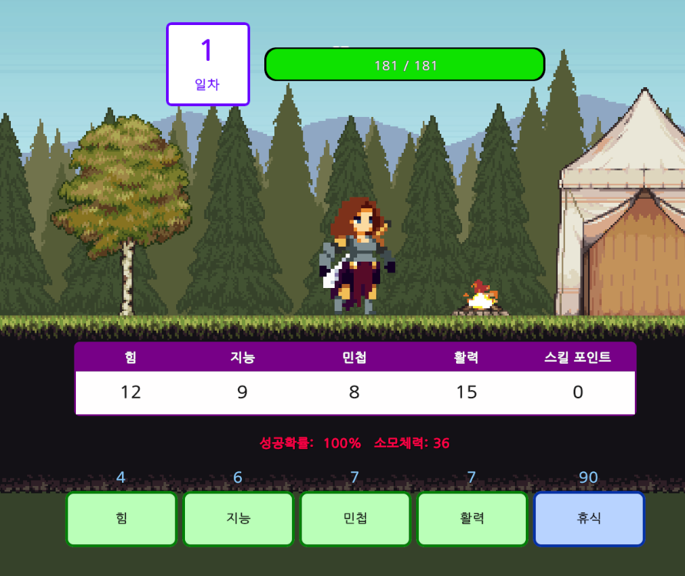

## 01. 목차

---

## 02. 개요

- **프로젝트 소개**  
유니티 2D게임으로 우마무스메와 유사한 방식으로 캐릭터를 육성하고 적을 물리치는 게임.
- **개발 인원**  
  1인 개발
- **사용 엔진**  
유니티 엔진 6
- **작업 기간**  
  1월 19일 ~ 2월 23일 (약 1달)

---

## 03. 프로젝트 요약
  
  - **게임 특징**  
  날짜별로 캐릭터를 육성하고 자동 전투를 통해 진행을 하는 게임으로 언리얼 엔진에 존재하는 프레임 워크인 Gameplay Ability System을 모방하여 Attribute(능력치)와 Ability(스킬)를 구현.

  - **주요기능 요약**
    - **Gameplay Ability System**: 캐릭터의 능력치를 저장하는 Attribute Set 클래스와 캐릭터의 스킬을 저장하는 Ability Component를 구현.
    - **캐릭터 강화**: Attribute를 올려 강화가 가능하며 이때 영구적 상승과 일시적 상승을 구분하여 버프나 아이템 장착 등에 대응이 가능하도록 구현.
    - **Event**: 정규 이벤트와 랜덤 이벤트를 구현하여 전투나 스탯 강화등 다양한 상황 연출.
    - **Dialgoue System**: 노드 기반의 다이얼로그 시스템 구현.
    - **Save and Load**: 날짜 및 능력치와 습득한 스킬을 저장 및 로드 가능하게 구현.
    - **FSM**: Finite State Machine을 통해 캐릭터의 상태 변경.
    - **Object Pooling**: 자주 사용하는 이펙트나 발사체는 풀링을 사용하여 최적화.
    - **MVC 패턴**: UI가 직접 모델에 접근하는 것이 아닌 컨트롤러를 이용.
---

## 04. 핵심 기능 및 구현 내용

### 01. Gameplay Ability System
**GAS**는 언리얼 엔진에 존재하는 프레임 워크를 모방하여 제작하였습니다. GAS에는 어빌리티를 부여하여 스킬들을 사용할 수 있고 Attribute Set 클래스가 존재하여 이곳에서 능력치를 설정합니다.

캐릭터 클래스는 이 GAS 컴포넌트를 가지고 있어 캐릭터 마다 고유의 스킬과 능력치를 가지게 됩니다.

### 01-1 Attribute(능력치)
attribute는 attribute set 클래스에서 설정되며 아래와 같이 이루어져 있습니다.

```c#
// Attribute의 값을 저장하는 클래스
public class AttributeValue
{
    public float baseValue;
    public float currentValue;

    public AttributeValue(float baseValue)
    {
        this.baseValue = baseValue;
        this.currentValue = baseValue;
    }
}

// Attribute Set 클래스 안에 있는 Attribute 별 값을 저장하는 Map
private Dictionary<EAttributeType, AttributeValue> attributes = new();
```
enum을 통해 attribute를 구분합니다.

attribute는 **baseValue**와 **currentValue**로 구분 되는데 base value는 기본적인 값이고 current value는 기본 값에 modifier에 따른 값을 더한 최종적인 실제 값을 나타냅니다.

둘을 구분한 이유는 영구적인 능력치 변화와 일시적인 능력치 변화를 구분하기 위해서입니다..


#### 1) Modifier
modifier는 능력치를 설정하기 위해 사용하는 구조체입니다.

```c#
// Attribute를 강화할 때 사용하는 구조체
public struct FAttributeModifier
{
    // 강화할 attribute의 타입 (str, dex, vit....)
    public EAttributeType attributeType;

    // 강화 할 값
    public float value;

    // 강화할 방식 Add(기존 값에 더하기), Multiplier(기존 값에 곱하기), Override(덮어쓰기)
    public EModifierOp operation;

    // instant(불변), duration(일정 기간 동안), infinite(영구적이나 제거 가능)
    public EModifierPolicy policy;
}

// 활성화 되어 있는 modifier를 id로 구분하고 저장하여 추후 제거가 가능하게 구현
public class ActiveModifier
{
    public FModifierHandle Handle;
    public FAttributeModifier Modifier;
}

 // 어트리뷰트 별로 적용되어있는 modifer 저장
 private Dictionary<EAttributeType, List<ActiveModifier>> modifiers = new();
```
각각의 modifier에는 policy가 존재하는데 이 중 **Instant** 정책은 base value를 바꾸고 나머지 정책은 **ActiveModifier**에 저장되어 current value를 계산할 때 사용합니다.


#### 02) modifier의 적용 및 제거
능력치는 modifier 구조체를 통하여 바꾸도록 구현하였습니다.

`FAttributeModifier` 구조체를 만들어 ASC에 전해줍니다. ASC에서는 policy를 구분하여 각각에 맞는 함수를 호출합니다.

```c#
// ASC 클래스에 존재하는 함수로 modifier를 적용
public FModifierHandle? ApplyModifier(FAttributeModifier modifier)
{
    if (modifier.policy == EModifierPolicy.Instant)
    {
        attributeSet.ApplyPermanentModifier(modifier);
        return null;
    }
    else
    {
        return attributeSet.ApplyOngoingModifier(modifier);
    }
}

///////// 이하 attribute set

// Instant 정책인 경우 base value를 변경
public void ApplyPermanentModifier(FAttributeModifier modifier)
{
    ApplyModifierToBaseValue(modifier);
    Recalculate(modifier.attributeType);
    PostAttributeChange(modifier);
}

// 그 외 정책인 경우 modifier를 attribute에 맞는 map에 추가
public FModifierHandle ApplyOngoingModifier(FAttributeModifier modifier)
{
   // modifier를 map에 추가하여 추후 사용
    var handle = AddToModifierList(modifier);

    Recalculate(modifier.attributeType);
    PostAttributeChange(modifier);

    return handle;
}
```
여기서 **FModifierHandle**에는 id가 저장되어 있어 modifier의 적용을 요청한 클래스에서 이 handle을 보관했다가 제거할 때 사용할 수 있습니다.

handle에는 id가 존재하며 modifier를 제거할 때 구분하기 위해 사용합니다.

id를 modifier를 보낼때 설정하는 방식도 있겠지만 서로 다른 클래스에서 id를 설정하는 작업은 실수가 발생할 수 있기 때문에 attribute set에서 id를 지정한 handle을 반환하고 이 handle을 보관하고 있다가 modifier를 제거하는데 사용할 수 있도록 구현하였습니다.

```c#
// base value와 modifier의 value를 합쳐 최종적인 값을 저장하는 함수
private void Recalculate(EAttributeType type)
{
  float baseValue = attributes[type].baseValue;

  float add = 0f;
  float mul = 1f;
  bool hasOverride = false;
  float overrideValue = 0f;

  // attribute type별로 저장된 modifier를 가져와 특성에 맞게 값 설정
  foreach (var mod in modifiers[type])
  {
      switch (mod.Modifier.operation)
      {
          case EModifierOp.Add:
              add += mod.Modifier.value;
              break;

          case EModifierOp.Multiply:
              mul *= mod.Modifier.value;
              break;

          case EModifierOp.Override:
              hasOverride = true;
              overrideValue = mod.Modifier.value;
              break;
      }
  }

  // base value에 modifier 값을 더하여 최종값 설정
  float finalValue = hasOverride ? overrideValue : (baseValue + add) * mul;

  attributes[type].currentValue = Mathf.Round(finalValue);
}
```
modifier를 적용할 때 마다 이 `Recalculate`함수를 사용하여 current value를 설정합니다.

#### 03) 2차 attribute 계산
2차 attribute는 1차 attribute가 변하면 따라서 변하는 attribute를 말합니다.

2차 attribute는 플레이어에게만 유효하며 에너미는 attribute가 변할 일이 없기 때문에 바로 2차 attribute를 modifier로 설정하는 방식으로 attribute를 정해주었습니다.

**전략 패턴을 통한 attribute 설정**  
2차 attribute는 `AttributeCalculator` 클래스에서 계산합니다.

이때 attribute 타입별로 서로 다른 계산 클래스를 사용해야하고 이를 위해 전략패턴을 적용하였습니다.

```c#
private Dictionary<EAttributeType, IAttributeCalculator> calculators = new();
```
Map에 attribute 별 계산기를 지정하여 필요할때마다 원하는 계산기를 사용하여 값을 알아낼 수 있습니다.

이를 통해 switch 문이나 if문 같은 복잡하고 가독성이 떨어지는 함수가 아니라 간단한 로직을 사용할 수 있게 되었습니다.

계산기 클래스의 구성은 아래와 같습니다.

```c#
public abstract class AttributeCalculatorBase : IAttributeCalculator
{
    // 현재 계산기가 담당하고 있는 attribute
    public abstract EAttributeType TargetAttribute { get; }

    // 계산기가 담당하는 attribute를 올리기 위해 필요한 attribute를 저장하는 list
    public abstract IReadOnlyList<EAttributeType> Dependencies { get; }

    protected abstract float CalculateAttribute(AttributeSet attributeSet);

    public float GetAttributeValue(AttributeSet attributeSet, EAttributeType type)
    {
        return CalculateAttribute(attributeSet);
    }
}
```
각각의 attribute를 담당하는 계산기 클래스는 `CalculateAttribute`함수를 오버라이드 하여 자신의 attribute를 계산합니다.

```c#
public class PhysicalAttackPowerCalculator : AttributeCalculatorBase
{
    public override EAttributeType TargetAttribute
      => EAttributeType.PhysicalAttackPower;

    public override IReadOnlyList<EAttributeType> Dependencies => new[]
    {
        EAttributeType.Strength,
        EAttributeType.Dexterity
    };

    protected override float CalculateAttribute(AttributeSet attributeSet)
    {
        float str = attributeSet.GetAttributeValue(EAttributeType.Strength);
        float dex = attributeSet.GetAttributeValue(EAttributeType.Dexterity);

        return 1f + str + (0.2f * dex);
    }
}
```
계산기 클래스의 예시 중 하나로 attribute set에서 1차 속성을 가져와 프로그래머가 자유롭게 2차 속성을 설정합니다. 

```c#
// attribute 타입별로 계산기 클래스 저장
private Dictionary<EAttributeType, IAttributeCalculator> calculators = new();

// 계산기 생성 함수
public void InitAttributeCalcualtor()
{
    // 전략 저장
    calculators.Clear();
    calculators = new Dictionary<EAttributeType, IAttributeCalculator>()
    {
        { EAttributeType.PhysicalAttackPower, new PhysicalAttackPowerCalculator() },
        { EAttributeType.PhysicalDefensePower, new PhysicalDefensePowerCalculator() },
        { EAttributeType.MagicAttackPower, new MagicAttackPowerCalculator() },
        { EAttributeType.MagicDefensePower, new MagicDefensePowerCalculator() },
        { EAttributeType.CriticalChance, new CriticalChanceCalculator() },
        { EAttributeType.MaxHealth, new MaxHealthChanceCalculator() },
        { EAttributeType.MaxMana, new MaxManaChanceCalculator() },
    };

  // ... (dependency 설정 부분 생략)
}

  private void CalculateDependentAttribute(EAttributeType type)
  {
      if (calculators.TryGetValue(type, out IAttributeCalculator calculator))
      {
          attributes[type].baseValue = calculator.GetAttributeValue(this);
      }
  }
```
이후 각각 계산기 클래스들은 map에 타입 별로 저장되어 attribute 변화시 각각의 타입에 맞는 계산기 클래스를 사용하여 값이 계산됩니다.

#### 04) defendancy 설정
2차 attribute가 어떤 1차 attribute에 의존하는지 알아야 1차 attribute가 변할때 그에 맞는 2차 attribute를 설정할 수 있을 것입니다. 그렇기에 계산기 클래스에는 해당 계산기가 의존하고 있는 attribute를 설정하여 이를 알 수 있게 하였습니다.

```c#
// AttributeCalculator

// 이 계산기가 관여하는 attribute
public override EAttributeType TargetAttribute
  => EAttributeType.PhysicalAttackPower;

// 이 계산기에서 사용(의존)할 attribute
public override IReadOnlyList<EAttributeType> Dependencies => new[]
{
    EAttributeType.Strength,
    EAttributeType.Dexterity
};
```

이렇게 계산기에 설정이 완료되면 계산기를 생성할 때 attribute의 의존성을 설정합니다.

```c#
// InitAttributeCalcualtor 함수에서 의존성 설정하는 부분

foreach (var calculator in calculators)
{
  // calculator.Key   = TargetAttribute
  // calculator.Value = 해당 Attribute의 Calculator
  foreach (EAttributeType dependency in calculator.Value.Dependencies)
  {
      // dependency: 현재 Calculator가 의존하고 있는 attribute

      // dependencyMap에 이미 리스트가 존재하는지 확인
      if (!dependencyMap.TryGetValue(dependency, out HashSet<EAttributeType> hasSet))
      {
          // 없으면 새로 생성
          hasSet = new HashSet<EAttributeType>();
          dependencyMap[dependency] = hasSet;
      }

      // dependency가 변경되었을 때 재계산해야 할 TargetAttribute 추가
      hasSet.Add(calculator.Value.TargetAttribute);
  }
}

////////////////////

// attribute set 클래스에 존재하는 의존성 저장하는 map
private readonly Dictionary<EAttributeType /*primary attribute*/, HashSet<EAttributeType> /* dependent attributes */> dependencyMap = new();
```
`dependencyMap`은 attribute별로 의존하고 있는 다른 attribute를 저장하는 map입니다. 

```c#
public void ProcessDirty(FAttributeModifier modifier)
{
  if (dependencyMap.TryGetValue(modifier.attributeType, out var dependencies))
  {
      foreach (var dependency in dependencies)
      {
          CalculateDependentAttribute(dependency);
          Recalculate(dependency);
          OnAttributeChanged?.Invoke(dependency, GetAttributeValue(dependency));
      }
  }
}

private void CalculateDependentAttribute(EAttributeType type)
{
  if (calculators.TryGetValue(type, out IAttributeCalculator calculator))
  {
      attributes[type].baseValue = calculator.GetAttributeValue(this);
  }
}
```

modifier를 통해 모든 attribute의 계산이 끝나면 의존성 map을 순회하여 변경할 attribute가 있는지 확인하고 값을 설정하게 됩니다.

**DFS 통한 순환 참조 예방**  
이렇게 Dependency를 이용할때 가장 주의해야할 점은 순환을 방지하는 것일겁니다. 만약 A attribute가 B attribute에 의존하고 있는데 그 반대도 마찬가지이면 ProcessDirty 함수가 영원히 실행되는 문제가 생길 것입니다.

비록 이 프로젝트에서는 모든 2차 attribute가 1차 attribute에만 의존하고 있기 때문에 순환이 생길 일은 없지만 포괄적이고 재사용이 가능한 시스템 구현을 위하여 순환 방지 대책을 구현하였습니다.

```c#
// 계산기 생성 함수에서 실행
#if UNITY_EDITOR
    ValidateNoCircularDependency(calculators.Values);
#endif

// DFS 사용하여 계산 로직에 순환 있는지 확인
private void ValidateNoCircularDependency(IEnumerable<IAttributeCalculator> calculators)
{
    // dependency있는 attribute를 모은 그래프 생성
    var graph = new Dictionary<EAttributeType, List<EAttributeType>>();
    foreach (var calc in calculators)
    {
        graph[calc.TargetAttribute] = calc.Dependencies.ToList();
    }

    // 탐색할 attribute와 방문 상태를 저장하는 Map.
    // 검사할 attribute는 calculator를 통해 생성하는 attribute.
    Dictionary<EAttributeType /* 검사할 attribute*/, int> visitState = new();
    foreach (var node in graph.Keys)
        visitState[node] = 0;

    // 그래프에 존재하는 attribute 순환 있나 검사 시작
    foreach (EAttributeType attribute in graph.Keys)
    {
        if (visitState[attribute] == 0)
        {
            if (HasCycleDFS(attribute, graph, visitState))
            {
                throw new Exception($"[AttributeSystem] Circular dependency detected at {attribute}");
            }
        }
    }
}

// DFS 검사를 통해 그래프에 존재하는 attribute의 자식 노드들을 전부 검사.
private bool HasCycleDFS(EAttributeType attribute, Dictionary<EAttributeType, List<EAttributeType>> graph, Dictionary<EAttributeType, int> visitState)
{
    // 현재 검사중인 attribute 표시
    visitState[attribute] = 1;

    // attribute와 관련된 dependencies 확인
    if (graph.TryGetValue(attribute, out List<EAttributeType> dependencies))
    {
        foreach (var dependentAttribute in dependencies)
        {
            // 현재 검사중인 attribute에 존재하는 dependent attribute가 또 dependency를 가지고 있는지 확인.
            if (!graph.ContainsKey(dependentAttribute)) continue;

            // 해당 attribute를 이미 방문했는지 확인
            if (visitState[dependentAttribute] == 1)
                return true; // 방문했으면 순환 중임

            // 아직 방문 안했으면 방문
            if (visitState[dependentAttribute] == 0)
            {
                // 재귀함수로 검사 시작
                if (HasCycleDFS(dependentAttribute, graph, visitState))
                    return true; // 자식 노드들 중 (순환)true가 반환되면 부모에도 전파
            }
        }
    }

    // 모든 자식 노드 확인 후 검사 완료 표시. 공통 자식을 가질 수 있기 때문에 별도의 표시 통해 재검사 방지.
    visitState[attribute] = 2;
    return false;
}
```
노드를 검사하여 모든 재귀함수 호출이 끝나지 않았는데 같은 현재 검사 중인 노드를 만나게 되면 순환이 있는 것이고 이는 잘못된 것이기 때문에 경고하여 다시 작성할 수 있게 구현하였습니다.

이때 노드의 순환 여부는 실제 빌드된 게임에서는 알아도 별 의미가 없기 때문에 유니티 엔진에서만 실행되도록 하였습니다.

### 01-2 Ability (스킬)
ability는 Ability System Component에 보관되며 id를 통해 구분하고 실행합니다.

#### 01) Ability 구현
AbilityLogicBase 클래스를 상속 받아 어빌리티를 구현합니다. 추상화를 통해 ASC는 각각의 어빌리티의 실제 구현을 알지 못하여도 Abiliy가 실행이 가능해집니다.

#### 02) ScriptableObject for ability


각각의 ability는 ScriptableObject에서 구체적인 값이 설정됩니다. 이를 통해 동일한 ability라고 하더라도 전혀 다른 대미지와 효과를 주어 다른 ability처럼 보이게 연출이 가능하며 이를 통해 더욱 쉽고 다양한 ability를 구현할 수 있게 하였습니다.

```c#
public abstract class BaseAbilityDataSO : ScriptableObject
{
    [Header("Ability Info")]
    public EAbilityId abilityId;
    public string abilityName;
    public float cooldown;
    public int sp;

    [Header("Anim Info")]
    public string animBoolName;
    public string animTag = "Skill";

    [Header("UI Info")]
    [TextArea (3, 10)] public string description;
    public Sprite icon;

    public abstract AbilityLogicBase CreateInstance();
}
```
Ability의 ScriptableObject 베이스 클래스로 이를 상속받아 추가적으로 필요한 요소를 추가하여 사용합니다.

해당 SO 클래스는 ASC에서 보관하며 ASC는 `CreateInstance`함수를 통해 abiltiy 로직이 담긴 클래스를 생성할 수 있게 됩니다.

```c#
public class Ability_NormallAttackSO : DamageAbilityDataSO
{
    [Header("ComboAttackInfo")]
    public int maxComboCount = 1;
    public string comboCountName = "comboCount";

    public override AbilityLogicBase CreateInstance()
    {
        return new NormalAttackAbility();
    }
}
```
기본(콤보)공격 SO의 예시로  `maxComboCount`변수를 추가하였고 `CreateInstance`함수를 오버라이드 하여 알맞은 인스턴스가 생성되도록 하였습니다.

#### 03) Ability Spec
ASC가 ability를 실행하기 위해서는 SO와 Ability Instance 둘다 필요할 것입니다. Ability Spec 클래스를 만들어 이곳에서 둘 다 보관하도록 하였습니다.

```c#
// AbilitySpec을 저장하는 클래스. Level이나 쿨다운을 설정
// ASC에 어빌리티가 spec으로 관리되기 때문에 SO의 속성을 바꾸는 것으로 동일한 Ability(id)라고 할지라도
// 다른 애니메이션과 대미지 구현이 가능
public class AbilitySpec
{
    public BaseAbilityDataSO abilityData;
    public AbilityLogicBase ability;
    public int level;

    public float lastActivatedTime;

    // spec에 사용할 ability 인스턴스를 생성
    public AbilitySpec(BaseAbilityDataSO data, AbilitySystemComponent asc)
    {
        this.abilityData = data;
        ability = data.CreateInstance();
        ability.Init(asc);
    }
}
```
이뿐만 아니라 Spec 클래스에서는 마지막으로 ability를 실행한 시점을 보관하여 쿨다운 계산등에도 사용하거나 ability의 레벨을 설정하여 강화하는 등 ability 사용에 필요한 요소들을 보관하게 됩니다.

```c#
private readonly List<AbilitySpec> abilities = new();
```
ASC는 위와 같은 spec이 담긴 list를 저장하여 ability를 보관합니다.

#### 04) Ability 부여 및 실행
```c#
/// Character Class
[Header("ASC")]
[SerializeField] private AttributeSO attributeInfoSO;
[SerializeField] private List<BaseAbilityDataSO> defaultAbilities; 
```
캐릭터 클래스에서는 부여할 ability의 정보가 담긴 SO 클래스를 리스트로 저장합니다.

```c#
public void GiveAbility(BaseAbilityDataSO data)
{
    abilities.Add(new AbilitySpec(data, this));
}
```
ASC는 이 SO 클래스를 받으면 Spec을 생성해 보관합니다.

```c#
public void TryActivateAbilityById(EAbilityId abilityId)
{
    if (Owner == null)
    {
        Debug.LogError($"Owner is not set on {gameObject.name}", this);
        OnAbilityEnded?.Invoke(abilityId);
        return;
    }

    if (activatedAbilitySpecs.ContainsKey(abilityId))
    {
        return;
    }

    AbilitySpec spec = abilities.Find(a => a.abilityData.abilityId == abilityId);
    if (spec != null && spec.ability.CanActivate(spec, this))
    {
        spec.ability.ActivateAbility(spec, this);
        activatedAbilitySpecs.Add(spec.abilityData.abilityId, spec);
    }
}
```
이후 id를 통해 ability를 찾아 실행시킵니다. `ActivateAbility`함수에 spec과 asc를 보내는데 이를 통해 각각의 ability는 자신의 정보가 담긴 SO클래스에 접근하여 대미지나 이펙트를 설정하며 owner의 정보를 찾아 위치나 적이 누구인지 등에 대해 알 수 있게 됩니다.

#### 05) Ability 구현 예시
스킬을 구현할때 가장 필요한 것은 애니메이션 재생과 이펙트 발생, 대미지 부여일 것입니다.

```c#
// 자식 클래스에서 호출할 함수로 콜백을 보내 애니메이션이 종료되면 콜백 실행
protected void PlayAbilityAnimationAndWait(AbilitySpec spec, IAbilitySystemContext context, Action callback)
{
    if (isAnimPlaying) return;

    isAnimPlaying = true;
    context.StartCoroutine(PlayAndWaitAbilityAnimation(spec, context, callback));
}

// ability base 클래스에 존재하는 애니메이션 실행함수로 애니메이션 실행 후 끝날때까지 하고 콜백 실행
private IEnumerator PlayAndWaitAbilityAnimation(AbilitySpec spec, IAbilitySystemContext context, Action callback)
{
    Animator animator = context.Owner.Anim;

    // 기존 재생중인 애니메이션이 있으면 끝날 때까지 대기
    yield return new WaitUntil(() =>
        !animator.GetCurrentAnimatorStateInfo(0).IsTag(spec.abilityData.animTag) &&
        !animator.IsInTransition(0)
    );

    animator.SetBool(spec.abilityData.animBoolName, true);

    // 애니메이션 재생 끝날때 까지 대기
    yield return new WaitUntil(() =>
    {
        return animator.GetCurrentAnimatorStateInfo(0).IsTag(spec.abilityData.animTag) &&
                animator.GetCurrentAnimatorStateInfo(0).normalizedTime >= 1f;
    });

    animator.SetBool(spec.abilityData.animBoolName, false);

    isAnimPlaying = false;
    callback?.Invoke();
}
```
애니메이션 종료시 콜백함수를 실행하고 싶어 함수를 만들었습니다.

해당 함수에서는 코루틴을 사용하여 애니메이션의 종료 시점을 정확히 판별하고 콜백 함수를 실행시킵니다.

animation event나 `StateMachineBehaviour` 클래스를 이용해서 애니메이션 종료 시점을 알아낼 수 도 있지만 애니메이션을 구현할 때마다 종료 시점을 직접 설정하는 것이 아닌 자동으로 알아낼 수 있게 만들기 위하여 로직을 따로 작성하였습니다.

애니메이션 종료 여부와 별도로 애니메이션 내에서 event를 보내고 싶을 수도 있기 때문에 이를 받고 콜백을 실행시키는 함수도 구현하였습니다.

```c#
// Ability Base 클래스
protected void WaitAnimationEvent(AbilitySpec spec, IAbilitySystemContext context, EAnimationEventType animationEvent, Action callback)
{
    // ASC에 현재 ability를 event 대기중인 ability로 저장
    context.RegisterWaitingAbility(animationEvent, spec, callback);
}

//////////////////

// ASC

// 어빌리티가 애니메이션을 기다릴 때 콜백을 저장하는 클래스
public class WaitingAbilityEntry
{
    public AbilitySpec spec;
    public Action callback;

    public WaitingAbilityEntry(AbilitySpec spec, Action callback)
    {
        this.spec = spec;
        this.callback = callback;
    }
}

// 이벤트를 대기중인 ability를 저장하는 map
private readonly Dictionary<EAnimationEventType, List<WaitingAbilityEntry>> waitingAbilitiesByAnimEvent = new();
```
`WaitAnimationEvent` 함수를 통해 ASC에 이벤트를 대기중이라고 등록하고 ASC는 이벤트를 수신하면 이벤트를 대기중인 ability를 찾아 콜백 함수를 실행시킵니다.

여기서 `List<WaitingAbilityEntry>`로 보관하여 한 애니메이션에서 여러 이벤트가 발생해도 대응할 수 있게 구현하고자 하였습니다.

#### 06) Cooldown 계산
쿨다운은 비교적 간단하게 계산합니다.

```c#
public virtual void OnEndAbility(AbilitySpec spec, IAbilitySystemContext context)
{
    isActivated = false;
    spec.lastActivatedTime = Time.time;
}
```
abliity가 종료되면 실행하는 함수로 spec에 마지막으로 실행한 시점을 저장합니다.

```c#
protected bool IsCooldownReady(AbilitySpec spec)
{
    if(spec.lastActivatedTime <= 0) return true;

    float elapsed = Time.time - spec.lastActivatedTime;
    return elapsed >= spec.abilityData.cooldown;
}
```
이후 ablility를 실행할 때 spec에 있는 쿨다운과 실행 후 경과 시점을 비교하여 쿨다운을 계산하게 됩니다.

#### 07) 대미지 부여
```c#
public struct FDamageInfo
{
    public IAbilityOwner Instigator; // 대미지 유발자
    public Transform DamageSource; // Instigator의 transform
    public float OriginalDamage; // 기본 대미지
    public EDamageType DamageType; // 대미지 타입(물리, 마법)
    public bool IsCritical; // 크리티컬 여부
    public Vector2 KnockbackPower; // 넉백 파워
    public float KnockbackDuration; // 넉백 지속 시간
}
```
위의 구조체는 대미지를 입힐 때 대미지 정보를 저장하는 구조체입니다. 해당 구조체는 직접 만드는 것이 아닌 대미지 계산 클래스를 사용하여 만들어집니다.

```c#
public class DamageCalculator
{
    // 대미지를 입힐때 얼마나 대미지를 입힐지 구하는 함수
    static public FDamageInfo CalculateOutgoingDamage(IAbilitySystemContext context, DamageAbilityDataSO damageDataSO, Transform damageSource)
    {
        float damage = 0;

        if (damageDataSO.damageType == EDamageType.Physical)
        {
            damage = context.AttributeSet.GetAttributeValue(EAttributeType.PhysicalAttackPower);
        }
        if (damageDataSO.damageType == EDamageType.Magic)
        {
            damage = context.AttributeSet.GetAttributeValue(EAttributeType.MagicAttackPower);
        }
        damage *= damageDataSO.damageMultiplier / 100;

        float criticalChance = context.AttributeSet.GetAttributeValue(EAttributeType.CriticalChance);
        float random = Random.value * 100f;
        bool isCritical = random < criticalChance;

        DebugHelper.Log($"[{damageSource.name}] is attempting to deal [{damage}] damage.");

        return new FDamageInfo(context.Owner, damageSource, Mathf.Round(damage), damageDataSO.damageType, isCritical, damageDataSO.knockbackPower, damageDataSO.KnockbackDuration);
    }
}
```
대미지는 단순히 스킬에서 지정하는 것이 아니라 attribute의 변화에 맞게 정하고 싶었고 그렇기에 별도의 클래스를 만들어 계산을 진행하도록 하였습니다.

```c#
// 대미지 입히는 예시
FDamageInfo damageInfo = DamageCalculator.CalculateOutgoingDamage(context, attackData, context.Owner.Transform);

foreach (var hit in hits)
{
    if (hit.TryGetComponent<IDamageable>(out var damageable))
    {
        damageable.TakeDamage(damageInfo);
    }
}
```
구조체를 만들었으면 인터페이스를 사용하여 구조체를 전송합니다.

#### 08) 대미지 적용.
```c#
public virtual void TakeDamage(FDamageInfo damageInfo)
{
    if (!abilitySystemComponent || isDead) return;

    // modifier를 통해 대미지 적용
    FAttributeModifier damageModifier = new()
    {
        attributeType = EAttributeType.IncommingDamage,
        value = DamageCalculator.CalculateIncomingDamage(abilitySystemComponent.AttributeSet, damageInfo),
        policy = EModifierPolicy.Instant,
        operation = EModifierOp.Add
    };

    // 타격 이펙트 재생
    if (vfxComponent) vfxComponent.PlayOnDamageVfx();
    abilitySystemComponent.ApplyModifier(damageModifier);

    // 넉백이 있을 경우 적용
    if (damageInfo.KnockbackPower != Vector2.zero)
    {
        if (knockbackCo != null)
            StopCoroutine(knockbackCo);

        // instigator와의 위치를 계산하여 넉백 방향 결정.
        int dir = transform.position.x > damageInfo.DamageSource.position.x ? 1 : -1;
        Vector2 kncokback = damageInfo.KnockbackPower;
        kncokback.x *= dir;
        knockbackCo = StartCoroutine(ExcuteKnockback(kncokback, damageInfo.KnockbackDuration));
    }

    if (showDebug)
        DebugHelper.Log($"[{gameObject.name}] took [{damageModifier.value}] damage from [{damageInfo.DamageSource.name}]");
}
```
대미지를 입는 함수로 대미지 역시 modifier를 통해 적용됩니다.

```c#
value = DamageCalculator.CalculateIncomingDamage(abilitySystemComponent.AttributeSet, damageInfo),
```
해당 구문이 얼마큼의 대미지를 입을지 구하는 구문으로 피해량 역시 방어력과 같은 attribute의 영향을 받기 때문에 대미지를 따로 계산하게 됩니다.

```c#
static public float CalculateIncomingDamage(IAttributeSet victimAS, FDamageInfo damageInfo)
{
    float defanse = 0;

    if (damageInfo.DamageType == EDamageType.Physical)
    {
        defanse = victimAS.GetAttributeValue(EAttributeType.PhysicalDefensePower);
    }
    if (damageInfo.DamageType == EDamageType.Magic)
    {
        defanse = victimAS.GetAttributeValue(EAttributeType.MagicDefensePower);
    }

    if (defanse > 0)
        defanse /= 100;

    float damage = damageInfo.OriginalDamage * (1 - defanse);

    if (damageInfo.IsCritical) damage *= 1.4f;

    return Mathf.Round(damage);
}
```
위의 함수는 방어력을 가져와 실제 피해량을 구하는 함수입니다.

### 02. 캐릭터 강화

모바일 게임 우마무스메의 육성 시스템을 참조하여 육성 시스템을 구현하였습니다.

#### 01) Attribute 강화
```c#
[Serializable]
public class AttributeGrowthData
{
    public int StrPoint;
    public int IntelliPoint;
    public int DexPoint;
    public int VitalPoint;
    public int SkillPoint;

    public float RelexPoint;
    public float Cost;
    public float SuccessChance = 1;

    public int GetUpgradeValueByType(EAttributeType type)
    {
        return type switch
        {
            EAttributeType.Strength => StrPoint,
            EAttributeType.Intelligence => IntelliPoint,
            EAttributeType.Dexterity => DexPoint,
            EAttributeType.Vitality => VitalPoint,
            EAttributeType.SkillPoint => SkillPoint,
            _ => 0
        };
    }
}
```
위의 클래스는 attribute의 강화 수치를 저장하는 클래스입니다. `AttributeGrowthData`는 `RuntimeGameState` 클래스에 저장되어 UI에 값을 보여주고 실제 강화를 진행할때 사용됩니다.

**Serializable** 필드를 사용한 이유는 세이브 후 로드를 할때 랜덤값이 변경되면 안되기 때문에 데이터를 저장하기 위하여 설정하였습니다.

```c#
public void UpgaradeAttribute(EAttributeType attribute)
{
    if (GameManager.Instance.RuntimeGameState.GrowthCalculator.IsSuccessUpgrade(GetHealthPercent()))
    {
        FAttributeModifier upgradeModifier = new()
        {
            attributeType = attribute,
            policy = EModifierPolicy.Instant,
            operation = EModifierOp.Add,
            // RuntimeGameState에 저장된 값을 가져옴
            value = GetUpgradeValue(attribute)
        };
        abilitySystem.ApplyModifier(upgradeModifier);

        // ... (cost나 skill point등 올려주는 부분 생략)

        // 다음날로 진행
        ProcessDayAfterUpgrade();
    }
}
```
플레이어가 UI 버튼을 눌러 업그레이드 요청을 하면 저장되어있는 값을 가져와 스탯을 올려주게 됩니다. 그후 업그레이드 값은 재설정하여 날짜마다 다른 값을 설정하게 됩니다.

#### 02) Ability 습득
attribute를 강화하면 랜덤하게 스킬 포인트가 오르게 됩니다. 이를 통해 스킬을 습득할 수 있게 됩니다.

```c#
// 플레이어 캐릭터 클래스에 있는 어빌리티 관련 변수들

// 해제(unlock)한 어빌리티의 아이디를 저장하는 Set
 private HashSet<EAbilityId> unlockedAbilityIdSet = new();

 // 해제해야하는 어빌리티를 저장하는 List
 public List<BaseAbilityDataSO> UnLockableAbilities => unlockableAbilities;
 // 위의 리스트를 map으로 저장하여 효율적으로 탐색 가능하게
 public Dictionary<EAbilityId, BaseAbilityDataSO> UnLockableAbilityMap => unlockableAbilitiesMap;
```
플레이어 캐릭터 클래스에는 위와 같이 해제해야 사용할 수 있는 ability 목록이 있고 이를 UI에 보여주게 됩니다.

```c#
private void CreateOrUpdateSkillWidget()
{
    // 스킬 UI에 필요한 정보(스킬명, 설명 등)
    FAbilityUIInfo[] infoArray = uiController.GetAllAbilityUiInfo();
    if (infoArray.Length == 0)
        return;

    foreach (var info in infoArray)
    {
        if (skillUIMap.ContainsKey(info.id))
        {
            UpdateWidget(info.id);
            continue;
        }

        var elemet = CreateSkillWidget(info);
        skillUIMap.Add(info.id, elemet);
        skillScrollView.Add(elemet);

        UpdateWidget(info.id);
    }
}
```
UI는 컨트롤러로부터 UI에 필요한 정보가 담긴 배열을 가져와 순회한 뒤 화면에 보여줍니다.

```c#
// 컨트롤러에서 ability 습득 요청을 하는 함수
public void UnlockAbility(EAbilityId id)
{
    if (GetAbilityRequiredSp(id) <= GetCurrentSp())
        owner.TryUnlockAbility(id);
}
```
스킬 포인트가 충분한지 확인하고 ability를 해제 요청합니다. 

```c#
// Player Character Class
public void TryUnlockAbility(EAbilityId id)
{
    // ... (유효성 체크 부분 생략)

    unlockedAbilityIdSet.Add(id);
}
```
캐릭터 클래스는 다시 한번 유효성을 확인하고 modifier를 통해 스킬포인트를 소모한 뒤 `unlockedAbilityIdSet`에 해제한 어빌리티의 아이디를 저장합니다.

```c#
foreach (BaseAbilityDataSO abilityData in unlockableAbilities)
{
    if (IsUnLockedAbility(abilityData.abilityId))
        ASC.GiveAbility(abilityData);
}
```
그 후 해제 여부를 확인하여 id를 비교한 후 어빌리티를 부여하게 됩니다.

### 03. Event
날짜가 진행됨에 따라 발생하는 정규이벤트와 랜덤한 확률로 발생하는 일반이벤트를 구현하였습니다.

#### 01) 시나리오 이벤트
```c#
[System.Serializable]
public class ScenarioEventInfo
{
    public string eventId;
    public int day;
    public EScenarioEventType type; // dialogue or battle
    public string dialogueId;
    public string battleInfoId;
    //reward
}

[CreateAssetMenu(fileName = "ScenarioEvent", menuName = "GameEvent/Scenario")]
public class ScenarioEventSO : ScriptableObject
{
    public List<ScenarioEventInfo> scenarioEvent;
    public int lastDay = 30;
}
```
시나리오 이벤트는 정규 이벤트를 뜻하며 특정 날짜마다 이벤트를 발생 시킵니다.

이벤트는 다이얼로그 또는 배틀로 이루어져있으며 다이얼로그 이벤트는 단순 대화만 배틀 이벤트는 배틀씬으로 이동하여 전투를 치루게 됩니다.

#### 02) 노멀 이벤트
```c#
[System.Serializable]
public class NormalEventInfo
{
    public string eventId;
    public string dialogueId;
    public bool isOnce = true;
}

[CreateAssetMenu(fileName = "NormalEvent", menuName = "GameEvent/Normal")]
public class NormalEventSO : ScriptableObject
{
    public List<NormalEventInfo> NormalEvent;

}
```
노멀 이벤트는 단순히 대화만 나오는 이벤트로 이때 리워드 다이얼로그를 통해 보상을 얻게 됩니다. 자세한 부분은 다이얼로그 파트에서 서술하도록 하겠습니다.

#### 03) 배틀 이벤트
```c#
[System.Serializable]
public class EnemySpawnInfo
{
    public GameObject Prefab;
    public int Level = 1;
    public int Count = 1;
}

[System.Serializable]
public class BattleEventInfo
{
    public string eventId;
    public string sceneName;
    public List<EnemySpawnInfo> enemieInfos;
}


[CreateAssetMenu(fileName = "BattleInformation", menuName = "GameEvent/Battle")]
public class BattleInfoSO : ScriptableObject
{
    public List<BattleEventInfo> battleInfoList;

    private Dictionary<string, BattleEventInfo> battleInfoMap;

    public void Init()
    {
        battleInfoMap = battleInfoList.ToDictionary(e => e.eventId);
    }

    public BattleEventInfo GetBattleInfo(string id)
    {
        if (string.IsNullOrEmpty(id))
        {
            DebugHelper.LogWarning("GetBattleInfo called with null or empty id");
            return null;
        }

        battleInfoMap.TryGetValue(id, out var data);
        return data;
    }
}
```
시나리오 이벤트가 배틀 이벤트일 경우 배틀을 위한 씬으로 이동한 후 배틀을 진행합니다.

이때 몬스터의 정보를 설정하는 SO가 **BattleInfoSO**입니다.

이곳에서는 id를 통해 배틀 정보를 가져오는데 이 정보에는 몬스터의 종류와 수, 레벨이 설정되어 있습니다.

#### 04) 이벤트 매니저
이벤트 매니저는 게임매니저로부터 현재 날짜를 받으면 실행 가능한 이벤트를 탐색하고 이를 실행시키는 역할을 하는 클래스입니다.

```c#
public void ProcessDay()
{
    day = tomorrow;
    DayChanged?.Invoke(day);

    if (day == scenarioEventSO.lastDay)
    {
        GameClear?.Invoke();
    }
    else if (eventManager.IsScenarioExist(day))
    {
        eventManager.ExecuteScenarioEvent(day);
    }
    else if (eventManager.CanTriggerNormalEvent(day))
    {
        eventManager.ExecuteNormalEvent(day);
    }
    else
    {
        OnEventFinished();
    }
}
```
위의 함수는 `Game Manager`클래스에서 이벤트를 실행하는 로직으로 실제 로직의 구현은 event manager가 담당하고 게임매니저는 그저 실행만 요청하는 형태로 구현하여 역할을 분리하였습니다.

### 04. Dialogue System
노드 기반의 다이얼로그 시스템을 구현하여 다양한 대화들을 이어지게 하였습니다.

다이얼로그 매니저는 이 노드들을 관리하며 UI 컨트롤러는 다이얼로그 매니저에 접근하여 대화 정보를 가져와 UI에 보여주게 됩니다.

#### 01) 노드 생성
다이얼로그는 ScriptableObject를 통해 작성되며 이를 바탕으로 노드들이 만들어지게 됩니다.

각각의 노드는 개별 클래스이며 이 안에 다이얼로그 정보를 담고 있습니다.

```c#
private void CreateTextNode()
{
    if (GameManager.Instance.NormalDialogueSO == null)
    {
        Debug.LogWarning("NormalDialogue Not Set");
        return;
    }

    List<NormalDialogueInfo> dialogueInfo = GameManager.Instance.NormalDialogueSO.dialogueInfo;
    foreach (var info in dialogueInfo)
    {
        DialogueTextNode textNode = new()
        {
            dialogueType = EDialogueType.Text,
            nodeId = info.dialogueId,
            nextNodeId = info.nextDialogueId,
            text = info.text,
            speakerName = info.speakerName
        };

        nodeMap.Add(info.dialogueId, textNode);
    }
}
```
노드를 생성하는 로직 중 일부로 SO 클래스로부터 정보를 가져와 노드를 만들게 됩니다.

#### 02) 노드 연결
각각의 노드는 다음 노드를 뜻하는 `nextNodeId` 변수가 존재합니다.

```c#
// UI controller 클래스에 존재하는 노드를 다루는 함수
private void HandleNormalDialogue()
{
    // 매니저 클래스로부터 노드를 가져옴
    DialogueTextNode node = GameManager.Instance.DialogueManager.GetDialogueNodeBy<DialogueTextNode>(nodeId);
    if (node == null) return;

    // 다이얼로그 정보를 저장
    FNormalDialogueInfo dialogueInfo = new()
    {
        speakerName = node.speakerName,
        text = node.text
    };

    // UI는 해당 event를 구독하여 다이얼로그를 화면에 표시
    TextDialogueRequested?.Invoke(dialogueInfo);
    nodeId = node.nextNodeId;
}
```
UI 컨트롤러는 이 변수를 설정하고 다이얼로그를 요청할때마다 id를 확인하여 올바른 노드를 가져옵니다.

#### 03) 노드의 종류
노드는 기본적인 대화 노드 보상이 있는 리워드 노드, 선택지 노드로 구성되어있습니다.

```c#
public struct FChoiceInfo
{
    public string dialogueId;
    public string text;
    public string nextNodeId;
}

public class DialogueChoiceNode : DialogueNodeBase
{
    public string groupId;
    public List<FChoiceInfo> choices = new();
}
```
이중 선택지 노드는 그룹 아이디로 연결되어 있어 동일한 그룹 아이디를 가진 노드들끼리 묶고 화면에 보여줍니다.

```c#
public class DialogueRewardNode : DialogueNodeBase
{
    public EAttributeType attribute;
    public int reward;
    public string nextNodeId;
}
```
리워드 노드는 보상 정보가 담겨 있어 이를 캐릭터에게 부여하는 방식으로 구현하였습니다.

### 05. Save & Load
캐릭터의 능력치와 진행된 일자, 스킬, 한번 본 이벤트, 능력치 강화 수치. 이렇게 5가지 요소를 저장할 수 있도록 구현하였습니다.

#### 01) RuntimeGameState
**RuntimeGameState**는 현재 게임의 실시간 정보를 담고 있는 클래스입니다. Game Manger에 소속되어 있는데 Game Manager는 `DontDestroyOnLoad` 설정이 되어 있어 Scene을 이동해도 데이터를 보관할 수 있게 하였습니다.

```c#
public class RuntimeGameState
{
    private PrimaryAttributeData playerData;
    private List<EAbilityId> unlokcedAbilityIds = new();

    private AttributeGrowthData currentGrowthData;
    private readonly AttributeGrowthCalculator growthCalculator;

    // ... (매서드 생략)
}
```
해당 클래스는 최초에는 Scene을 옮길 때 임시로 데이터를 저장하는 목적으로 제작되었지만 추후 세이브 로드시에도 사용할 수 있도록 구조를 확장하였습니다.

캐릭터의 실시간 정보가 이렇게 담겨 있기 때문에 해당 정보를 그대로 가져와 저장할 수 있게 됩니다.

#### 02) Save
```c#
// 게임 매니저에서 세이브 매니저에 세이브를 요청하는 함수
public void SaveGame()
{
    SaveData data = new()
    {
        Day = day, // 현재 날짜
        GrowthData = runtimeGameState.CurrentGrowthData, // attribute 성장치
        PrimaryAttributeData = runtimeGameState.PlayerData, // 1차 attribute
        UnlokcedAbilityIds = runtimeGameState.UnlokcedAbilityIds, // 습득한 ability
        TriggeredEvent = eventManager.TriggeredEventSet.ToList() // 한번 본 이벤트
    };

    SaveManager.SaveDataToDisk(data);
}
```
플레이어가 세이브 요청을 하면 정보들을 가져와 Json 파일로 저장하게 됩니다.

습득한 ability 정보든 한번 본 이벤트 정보든 전부 enum으로 만든 id로 이루어져 있기에 별도의 과정없이 직렬화가 가능해집니다..

#### 03) Load
Load는 Json 파일로부터 값을 읽어와 복원 작업을 시작합니다.

```c#
public void LoadGame()
{
    SaveData data = SaveManager.LoadDataFromDisk();
    if (data == null)
    {
        Debug.LogWarning("No save data found");
        return;
    }

    tomorrow = data.Day;
    startMode = EGameStartMode.LoadGame;

    runtimeGameState.UpdatePlayerData(data.PrimaryAttributeData, data.UnlokcedAbilityIds);
    runtimeGameState.LoadGrowthData(data.GrowthData);
    eventManager.RestoreTriggeredEvent(data.TriggeredEvent.ToHashSet());
    TravelToRestArea();
}
```
`RuntimeGameState`에 캐릭터 정보를 저장하면 캐릭터 클래스는 이곳에서 정보를 가져와 설정하게 됩니다.

### 06. AI
배틀 이벤트가 발생하면 배틀씬으로 이동하고 전투를 진행합니다. 전투는 플레이어와 에너미 모두 AI 로직을 이용한 자동 전투로 진행합니다.

#### 01) Fininte State Machine
state를 구현하여 해당 state에 맞는 애니메이션을 재생하고 움직임이나 스킬들을 발동합니다.

#### 02) AI Controller
FSM이 캐릭터들의 로직을 실행하는 클래스라면 AIC는 어떤 행동을 할지 정하는 클래스입니다.

#### 03) Enemy AI


에너미는 AI 로직을 간략화한 모식도입니다. 물론 단순히 위의 로직대로만 움직이는 것이 아닌 벽을 감지한다던가 후퇴동작이나 어떤 공격을 할지 결정하는 로직도 존재하여 좀 더 생동감이 느껴지도록 AI를 구현하였습니다.

#### 04) 랜덤 Ability 발동
**Fisher–Yates Shuffle Algorithm**  
랜덤으로 어빌리티를 발동하기 위하여 피셔-예이츠 셔플 알고리즘을 사용하여 랜덤 어빌리티를 발동할 수 있게 하였습니다.

```c#
public EAbilityId GetRandomAbilityId()
{
    // abilities : 발동 가능한 어빌리티 목록
    if (abilities.Count == 0)
        return EAbilityId.None;

    // 인덱스 리스트 생성
    List<int> indices = new();
    for (int i = 0; i < abilities.Count; i++)
    {
        // 평타 어빌리티 제외
        if (abilities[i].abilityData.abilityId == EAbilityId.NormalAttack)
            continue;

        indices.Add(i);
    }

    // Fisher–Yates Shuffle Algorithm (무작위 순열 생성 알고리즘)
    // 배열의 마지막 요소로부터 시작  // 배열의 첫번째 요소에 도착할 때까지 반복
    for (int i = indices.Count - 1; i > 0; i--)
    {
        // 0부터 현재 인덱스(i) 사이에서 무작위 정수 j를 선택
        int j = UnityEngine.Random.Range(0, i + 1);
        // i와 j의 위치를 서로 변경
        (indices[i], indices[j]) = (indices[j], indices[i]);
    }

    // 순서대로 어빌리티 확인해서 발동가능한 어빌리티 반환
    foreach (int index in indices)
    {
        var spec = abilities[index];
        if (spec.ability.CanActivate(spec, this))
        {
            return spec.abilityData.abilityId;
        }
    }

    return EAbilityId.None;
    }
```
셔플 알고리즘을 사용한 이유는 단순히 Random 알고리즘을 사용할 경우 쿨다운이 돌고 있는 어빌리티를 반환받을 수도 있으며 while문을 사용하더라도 모든 어빌리티를 순회하였는지 확인하기 번거롭기 때문에 모든 어빌리티를 셔플한 뒤 차례대로 검사하는 방식을 썼습니다.

이때 셔플은 실제 배열을 셔플하는 것이 아닌 인덱스만 셔플하여 최적화를 이루었습니다.

```c#
private IEnumerator AttackDecisionLoop()
{
    while (activate)
    {
        if (PendingAbilityId == EAbilityId.None)
        {
            DecideAttackType();
        }
        yield return new WaitForSeconds(2f);
    }
}

private void DecideAttackType()
{
    if (Random.value <= skillProbability)
    {
        PendingAbilityId = owner.ASC.GetRandomAbilityId();
    }
}
```
AIC는 일정 시간 간격으로 발동 가능한 어빌리티를 저장하고 State는 이를 확인하여 ability를 발동시킵니다.

### 07. Object Pooling
이펙트나 발사체(projectile) 같은 오브젝트들은 자주 반복 사용하기 때문에 풀링을 사용하여 최적화를 하였습니다.

에너미의 경우도 풀링을 할 수 있지만 본 프로젝트는 4명 이상의 에너미를 소환할 계획이 없기 때문에 오히려 풀링을 사용하는 것이 더 비효율적이라 판단하여 적용하지 않았습니다.

오브젝트 풀링은 Unity Engine에서 제공해주는 API를 사용하여 구현하였습니다.

#### 01) Pool Manager
```c#
public class PoolingManager : MonoBehaviour
{
    public static PoolingManager Instance { get; private set; }

    private EffectPool effectPool;
    private Dictionary<EObjectId, ObjectPoolHandle> poolHandles = new();

    // ... (생략)
}
```

풀링 매니저 클래스에서는 오브젝트 풀 클래스를 관리합니다.

오브젝트 풀이 두 종류가 있는데 첫번째는 최초에 만든 pool이고 두번째는 오브젝트별로 pool을 구분하기 위해 좀 더 정석적으로 제작한 풀입니다.

#### 02) Effect Pool
최초 오브젝트 풀링 기능을 만들때 이펙트를 위해 pool을 만들었고 이때 이펙트의 경우 애니메이션 재생이기 때문에 오브젝트를 여러개 만들 필요 없이 애니메이션만 바꿔서 재생하면 되지 않을까라는 생각으로 기능을 구현하기 시작하였습니다.

```c#
public void Play(AnimationClip clip)
{
    overrideController["BaseEffect_Active"] = clip;
    animator.Play(PlayHash, 0, 0);
    Invoke(nameof(ReturnToPool), clip.length);
}
```
pool에서 오브젝트를 꺼내와 Play 함수를 실행시키면 애니메이션을 바꿔끼워 재생시켜 다른 이펙트 연출이 가능하게 제작하였습니다.

#### 03) 정석 Object Pooling
Effect Pool을 사용하면 프리팹을 추가할 필요없이 애니메이션만 제작하면 간편하게 사용할 수 있다는 장점이 있었습니다. 하지만 이렇게 하니 문제가 프로젝타일같이 오브젝트마다 다른 설정을 해야하는 경우 굉장히 세팅이 힘들어진다는 점이었습니다.

이를 개선하고자 오브젝트별 풀을 따로두도록 구현을 하였습니다.

```c#
public class ObjectPoolConfig
{
    public EObjectId objectId;
    public GameObject prefab;
    public int defaultCapacity = 5;
    public int maxSize = 50;
}

[CreateAssetMenu(menuName = "Pooling/PoolConfig")]
public class PoolConfigSO : ScriptableObject
{
    public List<ObjectPoolConfig> PoolInfoList;
}
```
`ScriptableObject`을 통해 프리팹과 아이디를 설정하고 아이디를 통해 풀 오브젝트를 가져올 수 있게 구현하였습니다.

```c#
private void CreateObjectPool()
{
    if (poolConfigs == null)
    {
        DebugHelper.LogWarning("poolConfigs is null");
        return;
    }

    foreach (var config in poolConfigs.PoolInfoList)
    {
        if (poolHandles.ContainsKey(config.objectId)) continue;

        ObjectPoolHandle pool = new(config);
        poolHandles.Add(config.objectId, pool);
    }
}
```
`PoolConfigSO`를 바탕으로 pool을 생성하는 로직입니다.

---

## 05. 문제 해결 및 방법


---

## 06. 고찰 및 회고
유니티 프로젝트를 만들면서 언리얼 프로그래밍을 배우며 얻은 지식을 활용하고자 하였고 그렇기에 유사 GAS를 제작하게 되었습니다. 이를 통해 왜 엔진에서 기능들을 그런식으로 구현했는지 알 수 있었고 많은 학습을 할 수 있었습니다.

언리얼 엔진의 GAS를 제작한 프로그래머들은 정말 뛰어난 프로그래머들이고 그 프로그래머들이 로직을 작성할때 어떤 생각과 이유로 작성했는지를 조금이나마 깨달을 수 있었고 이는 저의 프로그래밍 실력을 늘리는데도 정말 많은 도움을 주었습니다.

단순히 엔진의 기능을 잘 사용하는 것이 아닌 왜 그런 그렇게 만들었는지를 아는 것이 게임엔진을 사용하는데 더욱 중요하다고 생각하였으며 앞으로 발전하기 위해 많은 공부를 해야겠다는 생각을 하였습니다.